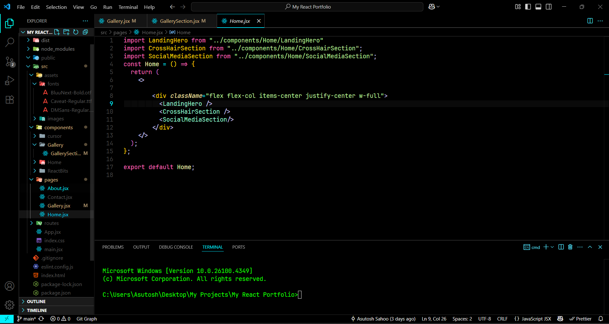

# 🖤 DevSena Ultra Dark — VS Code Theme

A minimalist ultra-dark theme for Visual Studio Code — built for night coders, Java warriors, and terminal lovers. Designed by Ash for the DevSena community.

# 🖤 DevSena Ultra Dark — VS Code Theme

A minimalist ultra-dark theme for Visual Studio Code...

## 🎯 Features

- Ultra-dark background for focus and comfort
- Vibrant, high-contrast syntax colors
- Supports Java, Python, JS, Rust, HTML/CSS, and more
- Custom terminal and UI shades
- Semantic token highlighting

## 📦 Installation

1. **Download or clone** this repo  
2. Copy the entire folder to:

   - Windows: `%USERPROFILE%\.vscode\extensions`
   - macOS/Linux: `~/.vscode/extensions`

3. Restart VS Code  
4. Open the Command Palette → `Color Theme` → Select **DevSena (ultra dark)**

## 🧑‍💻 Author

**Asutosh Sahoo** — [@DearAsutosh](https://github.com/DearAsutosh)  
Part of the **JavaWithAsh / DevSena** initiative

> _"Soch badlo, code badlega."_

## 📜 License

MIT License — free to use, modify, or fork.
